# 🎯 Полная диаграмма системы анализа звонков

## Mermaid диаграмма взаимодействия всех 25 узлов

```mermaid
graph TD
    %% ================================
    %% ВХОДНАЯ ТОЧКА
    %% ================================
    TRANSCRIPT[📄 Транскрипция звонка]
    
    %% ================================
    %% УРОВЕНЬ 1: ПРЯМЫЕ АНАЛИЗАТОРЫ (llm_db → text)
    %% ================================
    TRANSCRIPT --> COMP[📊 Анализ конкурентов<br/>llm_db → text<br/>competitors_mentioned]
    TRANSCRIPT --> PRODUCTS[📦 Анализ упомянутых продуктов<br/>llm_db → text<br/>products_mentioned]  
    TRANSCRIPT --> TEMP[📊 Анализ заинтересованности клиента<br/>llm_db → text<br/>client_temperature]
    TRANSCRIPT --> CALLTYPE[📞 Классификатор типа звонка<br/>llm_db → text<br/>call_type]
    
    %% ================================
    %% УРОВЕНЬ 2A: JSON АНАЛИЗАТОРЫ - ЭКСТРАКТОРЫ
    %% ================================
    TRANSCRIPT --> COMM[📋 Стандарты делового общения<br/>json_builder → jsonb<br/>communication_standards]
    TRANSCRIPT --> QUESTIONS[❓ Извлечение вопросов клиента<br/>json_builder → jsonb<br/>client_questions]
    TRANSCRIPT --> OBJECTIONS[⚠️ Извлечение возражений клиента<br/>json_builder → jsonb<br/>client_objections]  
    TRANSCRIPT --> SUMMARY[📝 Генератор краткого изложения<br/>json_builder → jsonb<br/>call_summary]
    TRANSCRIPT --> PAINS[😰 Извлечение болей клиента<br/>json_builder → jsonb<br/>client_pains]
    TRANSCRIPT --> INTERACTIONS[🔄 Анализ предыдущих взаимодействий<br/>json_builder → jsonb<br/>previous_interactions]
    TRANSCRIPT --> OBJMETHODS[🛠️ Анализ методов возражений<br/>json_builder → jsonb<br/>objection_methods]
    
    %% ================================
    %% УРОВЕНЬ 2B: CQR КРИТЕРИИ (json_builder → jsonb)
    %% ================================
    TRANSCRIPT --> CQR1[🎯 CQR: Оценка приветствия<br/>json_builder → jsonb<br/>cqr_greeting]
    TRANSCRIPT --> CQR2[🎯 CQR: Оценка речи<br/>json_builder → jsonb<br/>cqr_speech]
    TRANSCRIPT --> CQR3[🎯 CQR: Оценка инициативности<br/>json_builder → jsonb<br/>cqr_initiative]
    TRANSCRIPT --> CQR4[🎯 CQR: Оценка программирования<br/>json_builder → jsonb<br/>cqr_programming]
    TRANSCRIPT --> CQR5[🎯 CQR: Оценка квалификации<br/>json_builder → jsonb<br/>cqr_qualification]
    TRANSCRIPT --> CQR6[🎯 CQR: Оценка презентации продукта<br/>json_builder → jsonb<br/>cqr_product]
    TRANSCRIPT --> CQR7[🎯 CQR: Оценка выявления проблем<br/>json_builder → jsonb<br/>cqr_problem_identification]
    TRANSCRIPT --> CQR8[🎯 CQR: Оценка закрытия<br/>json_builder → jsonb<br/>cqr_closing]
    TRANSCRIPT --> CQR9[🎯 CQR: Оценка следующего шага<br/>json_builder → jsonb<br/>cqr_next_step]
    
    %% ================================
    %% УРОВЕНЬ 3: ОЦЕНЩИКИ КАЧЕСТВА (зависят от экстракторов)
    %% ================================
    QUESTIONS --> QGRADE[📊 Оценка качества ответов на вопросы<br/>json_builder → jsonb<br/>questions_quality]
    OBJECTIONS --> OGRADE[📊 Оценка качества отработки возражений<br/>json_builder → jsonb<br/>objections_quality]
    OBJECTIONS --> FAILURE[📋 Анализатор провала сделки<br/>json_builder → jsonb<br/>deal_failure_analysis]
    
    %% ================================
    %% УРОВЕНЬ 4: КАЛЬКУЛЯТОРЫ (code)
    %% ================================
    QGRADE --> QAVG[⚙️ Расчет среднего балла по вопросам<br/>code → decimal<br/>average_questions_grade]
    OGRADE --> OAVG[⚙️ Расчет среднего балла по возражениям<br/>code → decimal<br/>average_objections_grade]
    
    %% ================================
    %% УРОВЕНЬ 5: CQR КАЛЬКУЛЯТОР (агрегирует все CQR)
    %% ================================
    CQR1 --> CQRCALC[⚙️ CQR калькулятор<br/>code → jsonb<br/>cqr_final_score]
    CQR2 --> CQRCALC
    CQR3 --> CQRCALC
    CQR4 --> CQRCALC
    CQR5 --> CQRCALC
    CQR6 --> CQRCALC
    CQR7 --> CQRCALC
    CQR8 --> CQRCALC
    CQR9 --> CQRCALC
    CALLTYPE --> CQRCALC
    
    %% ================================
    %% УРОВЕНЬ 6: ФИНАЛЬНОЕ СОХРАНЕНИЕ (db_writer)
    %% ================================
    COMP --> DATASAVER[💾 Сохранение данных в Supabase<br/>db_writer<br/>Агрегирует ВСЕ 24 результата]
    PRODUCTS --> DATASAVER
    TEMP --> DATASAVER
    CALLTYPE --> DATASAVER
    
    COMM --> DATASAVER
    QUESTIONS --> DATASAVER
    OBJECTIONS --> DATASAVER
    SUMMARY --> DATASAVER
    PAINS --> DATASAVER
    INTERACTIONS --> DATASAVER
    OBJMETHODS --> DATASAVER
    
    CQR1 --> DATASAVER
    CQR2 --> DATASAVER
    CQR3 --> DATASAVER
    CQR4 --> DATASAVER
    CQR5 --> DATASAVER
    CQR6 --> DATASAVER
    CQR7 --> DATASAVER
    CQR8 --> DATASAVER
    CQR9 --> DATASAVER
    
    QGRADE --> DATASAVER
    OGRADE --> DATASAVER
    FAILURE --> DATASAVER
    
    QAVG --> DATASAVER
    OAVG --> DATASAVER
    CQRCALC --> DATASAVER
    
    %% ================================
    %% ФИНАЛЬНАЯ ТОЧКА
    %% ================================
    DATASAVER --> SUPABASE[(🗄️ База данных Supabase<br/>Таблица: call_analysis<br/>24 колонки с результатами)]
    
    %% ================================
    %% СТИЛИ ДЛЯ РАЗНЫХ ТИПОВ УЗЛОВ
    %% ================================
    classDef llmdb fill:#e1f5fe,stroke:#01579b,stroke-width:2px,color:#000
    classDef jsonbuilder fill:#f3e5f5,stroke:#4a148c,stroke-width:2px,color:#000
    classDef code fill:#fff3e0,stroke:#e65100,stroke-width:2px,color:#000
    classDef dbwriter fill:#e8f5e8,stroke:#1b5e20,stroke-width:2px,color:#000
    classDef input fill:#fff9c4,stroke:#f57f17,stroke-width:3px,color:#000
    classDef database fill:#ffebee,stroke:#c62828,stroke-width:3px,color:#000
    
    %% ================================
    %% ПРИМЕНЕНИЕ СТИЛЕЙ
    %% ================================
    class TRANSCRIPT input
    class COMP,PRODUCTS,TEMP,CALLTYPE llmdb
    class COMM,QUESTIONS,OBJECTIONS,SUMMARY,PAINS,INTERACTIONS,OBJMETHODS,QGRADE,OGRADE,FAILURE,CQR1,CQR2,CQR3,CQR4,CQR5,CQR6,CQR7,CQR8,CQR9 jsonbuilder
    class QAVG,OAVG,CQRCALC code
    class DATASAVER dbwriter
    class SUPABASE database
```

## 📊 Статистика системы

- **Всего узлов:** 25
- **llm_db (прямо в БД):** 4 узла
- **json_builder (JSON в БД):** 16 узлов  
- **code (вычисления):** 3 узла
- **db_writer (сохранение):** 1 узел
- **Финальных колонок в Supabase:** 24

## 🔄 Потоки данных

### 1. **Прямые анализаторы** (transcript → БД)
- Анализ конкурентов → `competitors_mentioned`
- Анализ продуктов → `products_mentioned`  
- Анализ заинтересованности → `client_temperature`
- Классификатор звонка → `call_type`

### 2. **Цепочки зависимостей**
- `transcript` → `client_questions_extractor` → `questions_quality_grader` → `questions_average_calculator`
- `transcript` → `client_objections_extractor` → `objections_quality_grader` → `objections_average_calculator`
- `transcript` → `client_objections_extractor` → `deal_failure_analyzer`

### 3. **CQR система** (9 критериев → калькулятор)
- Все 9 CQR оценщиков + тип звонка → CQR калькулятор → итоговый балл

### 4. **Финальная агрегация**
- Все 24 узла → Data Saver → Supabase (одна запись со всеми результатами)

## ⚙️ Типы обработки

### 🟦 **llm_db** - Простой LLM анализ
- Входные данные: transcript
- Обработка: LLM prompt  
- Выход: простой текст → Supabase

### 🟪 **json_builder** - Структурированный LLM анализ  
- Входные данные: transcript (+ зависимости)
- Обработка: LLM prompt + JSON prompt
- Выход: JSON объект → Supabase

### 🟨 **code** - Программные вычисления
- Входные данные: результаты других узлов
- Обработка: JavaScript код
- Выход: вычисленные значения → Supabase

### 🟩 **db_writer** - Сохранение данных
- Входные данные: все результаты анализа
- Обработка: агрегация и запись
- Выход: подтверждение сохранения

## 🎯 Ключевые особенности архитектуры

1. **Параллельная обработка:** Большинство узлов могут работать параллельно
2. **Четкие зависимости:** Только 4 узла имеют зависимости от других
3. **Централизованное сохранение:** Один узел собирает все результаты
4. **Типизированные данные:** Четкое разделение на text/jsonb/decimal типы
5. **Масштабируемость:** Легко добавлять новые анализаторы
